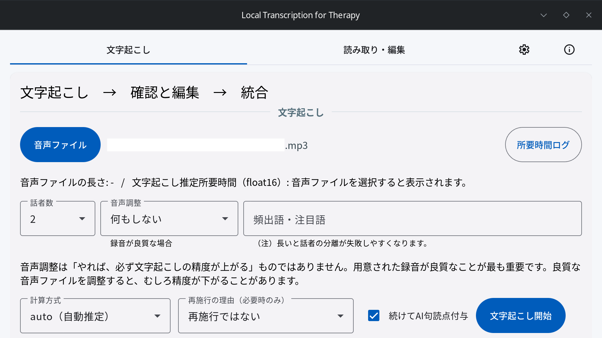
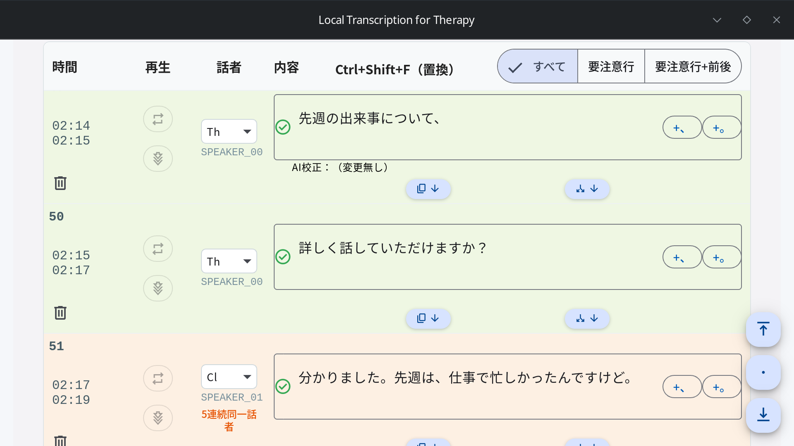

# Local Transcription for Therapy (LoTT)

**日本語** | [English](README.en.md)

臨床心理・カウンセリング会話のための、ローカル完結の日本語文字起こし・逐語録作成を補助するデスクトップアプリケーションです。
文字起こし・話者分離・文章校正を、会話データを PC の外へ送ることなく実行できます。
アプリケーションが全自動で完璧な逐語録を作ることを目指してはおらず、アプリケーションはおおまかな下書きを作ります。それを人間が会話（音声ファイル）を振り返りながら逐語録を完成させることを想定しています。

## 特徴

- **完全ローカル実行** — 運用時はインターネット接続不要。会話・音声データを PC 外の API へ送信しません
- **日本語の文字起こし** — faster-whisper（既定は Whisper turbo。高精度の large-v3 を後からダウンロードして選択可能）
- **話者分離** — pyannote.audio による話者の自動識別（既定ラベル: Th / Cl / IP …）
- **校正** — ルールベース + ローカル LLM。氏名・地名など個人の特定につながりうる語の警告表示。校正AIは標準（Gemma 4 E4B）に加え、高精度モデル（Gemma 4 12B、NVIDIA / AMD 共通・後からダウンロード）を選択可能
- **音声入力** — 編集画面の各行でマイク録音（最大15秒）すると、ローカル AI が聞き取って編集欄への挿入候補を最大3件提示（設定タブの「音声入力パック」を導入後に利用可能）
- **区間聞き直し** — 行の時間範囲の音声を AI が聞き直し、行の内容を置き換える候補を最大3件提示。文字起こしが怪しい行の修正を補助
- セグメント表の編集・句点での分割・セグメント単位の音声再生
- Word（.docx）/ Excel（.xlsx）/ JSON 形式での保存

## プライバシーとオフライン方針

- 文字起こし・話者分離・校正の実行時にインターネット上の API を呼びません。
- インターネット接続が必要なのは、初回セットアップ（依存パッケージ・モデル取得）のみです。
- LLM 校正の「OpenAI 互換 API」対応はプロトコル互換を意味するだけで、接続先は localhost / loopback に限定しています。クラウド推論エンドポイントには接続できない設計です。
- 本アプリ自身は通常運用時に外部へ通信しませんが、OS・WebView ランタイム（WebView2 / WebKitGTK）・GPU ドライバなどのシステム側コンポーネントは、本アプリとは無関係に外部と通信することがあります。組織として完全なオフライン運用を求める場合は、OS やファイアウォール側の設定（ネットワーク遮断、プロキシ制限など）を併用してください。
- 技術者でない方向けの説明は [プライバシー説明（非エンジニア向け）](docs/privacy-guide.md)、利用者自身で送信がないことを確かめる手順は [オフライン動作の確認手順](docs/offline-verification.md) を参照してください。

### ローカルAIアプリ（LM Studio / Ollama）連携について

- 公式配布のインストーラーでは、同じ PC 上で動作するローカルAIアプリ（LM Studio / Ollama）との連携は **無効**です。インストール時の選択肢や、アプリ内で有効化するスイッチはありません。標準では内蔵 AI（Gemma 4 E4B）で校正できます。
- 連携が必要な場合は、ソースコードから Cargo feature `local-llm-apps` を付けて専用インストーラーをビルドしてください。手順は [Windows リリースビルド](docs/release-build-windows.md#ローカルaiアプリ連携を有効にした専用ビルド) を参照してください。
- 連携を有効にした場合でも接続先は loopback に限定されますが、**接続先アプリ（LM Studio / Ollama）自体の挙動は本アプリの管理外**です。これらのアプリの設定によっては会話データが PC 外へ送信される可能性があります。通常運用では有効化しないことを推奨します。

## エディション

| エディション | 内容 |
| --- | --- |
| **LoTT Full CUDA** | 主配布。NVIDIA RTX / CUDA 向け。文字起こし・話者分離・校正のすべてを含む |
| LoTT Full AMD (ROCm / Vulkan) | experimental。AMD GPU 向け。文字起こし・話者分離・LLM 校正の GPU 動作確認済み（LLM は ROCm 優先・Vulkan フォールバック） |
| LoTT CPU | お試し版。CPUで文字起こし・話者分離・単純な句読点付与を行う。全体校正は非搭載。音声入力パックを導入すると音声入力・区間聞き直しも利用可能。処理時間の目安は音声時間の約1.5〜2.5倍 |
| LoTT Editor | 校正・編集中心の軽量版。全体の文字起こし・LLM 校正ランタイムは非搭載。音声入力パック（任意ダウンロード）を導入すると CPU 版ローカル AI による音声入力・区間聞き直しを利用可能（メモリ 16GB 未満では非推奨） |

## 動作環境（Full CUDA 版）

- Windows 10 / 11 64bit
- NVIDIA GPU（RTX 推奨）+ CUDA Toolkit 12.x（13以上は不可） + cuDNN 9.x
- **VRAM 8GB 以上（最低要件）**
- インストーラー約 1GB 前後 + モデルダウンロード分の空き容量

## CPU 版（お試し用）

LoTT CPU は、対応 GPU がない PC でもローカル完結の文字起こしを試せるエディションです。文字起こし、話者分離、単純な句読点付与に対応します。全体校正は搭載しません。音声入力パックを追加すると、CPU による音声入力と区間聞き直しも利用できます。

**処理時間が長くなるため、日常的・継続的な常用は推奨しません。** 少量の音声で動作や文字起こし品質を確認するお試し用途、または対応 GPU を用意できない場合の補助的な利用を想定しています。

| 項目 | 最低要件 | 推奨要件 |
| --- | --- | --- |
| OS | Windows 10 / 11 64bit | Windows 11 64bit |
| CPU | AVX2 対応、4コア / 8スレッド | 6コア / 12スレッド以上 |
| RAM | **16GB** | **24GB 以上** |
| ディスク空き容量 | 約10GB | 約15GB以上 |
| GPU | 不要 | 不要 |

- RAM 16GB は文字起こし・話者分離・単純な句読点付与を行うための実用上の下限です。他のアプリを同時に多数起動すると、処理速度低下やメモリ不足が発生する可能性があります。
- 音声入力・区間聞き直しでは Gemma 4 E4B 本体と音声 mmproj も使用するため、RAM 24GB以上を推奨します。16GB環境では他のアプリを終了してから利用してください。
- RAM 16GB未満はサポート対象外とします。スワップによる大幅な速度低下や、メモリ不足による失敗が想定されます。
- CPU版は起動時に最低要件（RAM 16GB以上、AVX2、8論理スレッド以上）を確認します。満たさない場合は不足項目を表示して終了し、満たす場合もお試し用である旨と処理時間の注意を毎回表示します。
- 処理時間の目安は音声時間の約1.5〜2.5倍ですが、CPU性能や音声内容によりさらに長くなる場合があります。開発機では、約12分の音声に対して約20分かかりました。

## インストールと初回セットアップ

1. NSIS インストーラー（`*_x64-setup.exe`）を実行します
2. アプリ起動後、セットアップタブから「Python パッケージをインストール」を実行します（要ネット接続）
3. 同じセットアップタブから必要なモデルをダウンロードします
   - 文字起こしモデル（Whisper turbo。高精度の large-v3 は任意で後から追加可能）
   - 話者分離モデル（`pyannote-speaker-diarization-community-1`、Hugging Face トークンが必要）
   - 校正用 LLM（Gemma 4 E4B GGUF。Full 版のみ）
   - 音声入力パック（任意。音声入力・区間聞き直しを使う場合）

モデル取得後はオフラインで運用できます。

## 使い方

1. 音声ファイルを選択して文字起こしを実行
2. 音声ファイルを聞きながら、結果の会話内容・話者を編集（話者ラベル既定値: `SPEAKER_00 → Th`、`SPEAKER_01 → Cl` など）
   - 編集中は、マイクからの音声入力や、行の時間範囲を AI に聞き直させる「区間聞き直し」も利用できます（要・音声入力パック）
3. Word / Excel / JSON 形式で保存

## 技術スタック

- Desktop: Tauri 2 (Rust) / Frontend: Angular 21 + Angular Material / Sidecar: Python
- ASR: faster-whisper（turbo 既定 / large-v3 高精度・後付けダウンロード） / Diarization: pyannote.audio / 音声デコード: LGPL 構成 ffmpeg CLI
- 音声入力・区間聞き直し: Gemma 4 E4B + 音声 mmproj（llama.cpp llama-server、OpenAI 互換 `input_audio`、loopback 限定）
- LLM 校正: Gemma 4 E4B（既定）/ Gemma 4 12B QAT+MTP（高精度・後付けダウンロード。NVIDIA=CUDA 直起動 / AMD=ROCm 優先・Vulkan フォールバック）+ 同梱/DL llama.cpp llama-server / ローカル OpenAI 互換 API（loopback 限定）

## ドキュメント

- プライバシー説明（非エンジニア向け）: [docs/privacy-guide.md](docs/privacy-guide.md)
- オフライン動作の確認手順: [docs/offline-verification.md](docs/offline-verification.md)
- 倫理審査向け資料テンプレート: [docs/irb-template.md](docs/irb-template.md)
- 開発環境セットアップ・内部仕様: [docs/development.md](docs/development.md)
- トラブルシューティング（CUDA / AMD ROCm 含む）: [docs/troubleshooting.md](docs/troubleshooting.md)
- 配布ビルド（Windows NSIS）: [docs/release-build-windows.md](docs/release-build-windows.md)
- FFmpeg / PyAV ライセンス方針: [docs/lgpl-pyav-build.md](docs/lgpl-pyav-build.md)

## ライセンス

本アプリは [Apache License 2.0](LICENSE) で配布します。
同梱の FFmpeg は LGPL 構成のビルドを使用しています。第三者ライセンスの一覧は [THIRD_PARTY_LICENSES.md](THIRD_PARTY_LICENSES.md) を参照してください。
