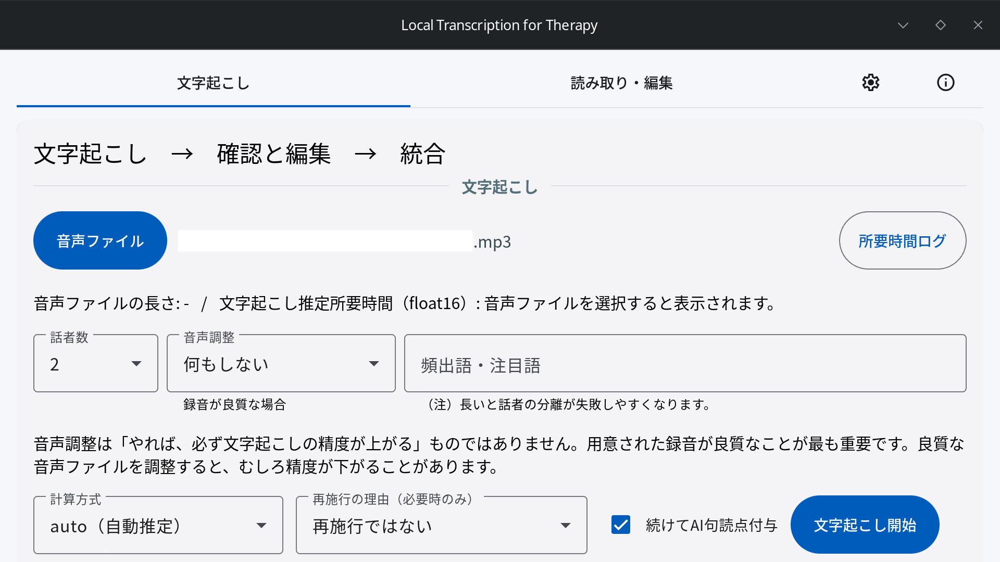
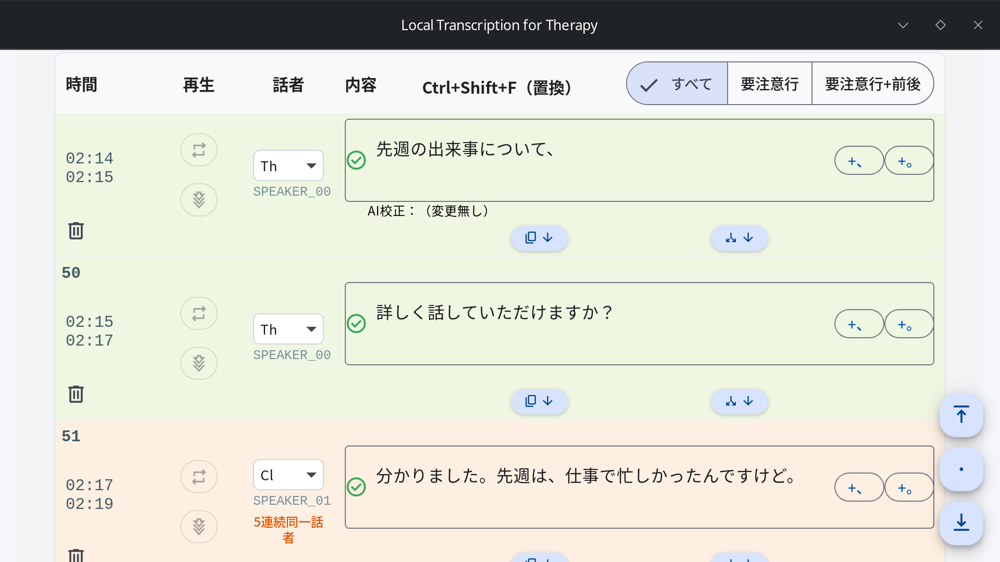

# Local Transcription for Therapy (LoTT)

**日本語** | [English](README.en.md)

臨床心理・カウンセリング会話のための、ローカル完結の日本語文字起こし・逐語録作成を補助するデスクトップアプリケーションです。
文字起こし・話者分離・文章校正を、会話データを PC の外へ送ることなく実行できます。
アプリケーションが全自動で完璧な逐語録を作ることを目指してはおらず、アプリケーションはおおまかな下書きを作ります。それを人間が会話（音声ファイル）を振り返りながら逐語録を完成させることを想定しています。

## 特徴

- **完全ローカル実行** — 運用時はインターネット接続不要。会話・音声データを PC 外の API へ送信しません
- **文字起こし** — whisper.cpp（Whisper large-v3-turbo + Silero VAD）。既定は日本語で、設定から24言語を選べます。「話者分離非対応」ラベルの言語も話者分離処理を実行します。NVIDIA / AMD / Intel の GPU を Vulkan で使い、GPU が無い PC では CPU で動作します。必要に応じて文字起こし前の音声調整（低域ノイズ除去・ノイズ除去・音量の正規化）を選べます（良質な録音では、かえって精度が下がることがあります）
- **話者分離** — NeMo-Speech.cpp + Nemotron-3-Diarization による話者の自動識別（既定ラベル: Th / Cl / IP …）
- **校正** — 日本語の文字起こしにローカルルールで句読点を自動付与します。氏名・地名など個人の特定につながりうる語も警告表示します。AI（LLM）による校正・全体校正はありません
- **音声入力** — 編集画面の各行でマイク録音（最大15秒）すると、ローカルの whisper.cpp で文字起こしを行い候補を1件提示（Full 版は GPU があれば GPU、無ければ CPU。Editor 版は常に CPU）
- セグメント表の編集・句点での分割・セグメント単位の音声再生
- Word（.docx）/ Excel（.xlsx）/ SRT字幕 / JSON形式での保存。SRTは任意のパスワードでAES-256暗号化ZIPとしても保存可能
- システム設定に追従するライト / ダークテーマと、編集・再生・音声入力を操作するキーボードショートカット

## 旧バージョンをお使いの方へ

CUDA 版・AMD (ROCm) 版・CPU 版と、Gemma 4 などによる AI 校正・全体校正（LM Studio / Ollama 連携を含む）は廃止しました。現在の配布は下記の2エディションです（Windows と Linux。Linux 版は実機での動作確認が未実施の試験的な配布です）。旧版が残したデータは、Full 版の設定タブから一覧を確認して削除できます。

## プライバシーとオフライン方針

- 文字起こし・話者分離・校正の実行時にインターネット上の API を呼びません。
- インターネット接続が必要なのは、初回セットアップ（モデル取得）のみです。
- AI（LLM）による推論機能は持たないため、会話データを推論サーバーへ渡す経路はありません。
- 本アプリ自身は通常運用時に外部へ通信しません。Windows 版では WebView2 のクラッシュダンプが Microsoft へ自動送信されないよう設定しています。ただし、OS・WebView ランタイム（WebView2）・GPU ドライバなどのシステム側コンポーネントが行う必須診断・更新確認等の通信までは、本アプリから完全には制御できません。組織として完全なオフライン運用を求める場合は、OS やファイアウォール側の設定（ネットワーク遮断、プロキシ制限など）を併用してください。
- 技術者でない方向けの説明は [プライバシー説明（非エンジニア向け）](docs/privacy-guide.md)、利用者自身で送信がないことを確かめる手順は [オフライン動作の確認手順](docs/offline-verification.md) を参照してください。

## エディション

| エディション | 内容 |
| --- | --- |
| **LoTT Full** | 主配布。文字起こし（whisper.cpp）・話者分離（Nemotron-3-Diarization）・ローカルルールの句読点付与・音声入力を含む。NVIDIA / AMD / Intel の GPU に1つのインストーラーで対応（Vulkan）。GPU が無い PC では CPU で動作（時間がかかる）。CUDA Toolkit・cuDNN・Python・Hugging Face トークンは不要 |
| LoTT Editor | JSONの校正・編集に特化した軽量版。文字起こし・話者分離は非搭載。音声入力パック（任意、Whisper large-v3-turbo + 無音検出モデル、約1.6GB）を導入すると、GPU不要の whisper.cpp（CPU実行）による音声入力を利用可能 |

Full 版の初回セットアップでダウンロードするのは、音声認識モデル（約1.6GB。whisper.cpp・VADを含む）と話者分離モデル Nemotron-3-Diarization（約0.1GB、NVIDIA の OpenMDW-1.1 ライセンス。セットアップ画面から本文を確認できます）だけで、合計約1.7GBです。固定 revision・SHA-256 検証・中断再開に対応し、Hugging Face のアカウントやトークンは不要です。

GPU が複数ある PC では、内蔵 GPU 以外で VRAM が最大の GPU を音声エンジンに自動で使います。設定タブで変更できます。

## 動作環境

- Windows 10 / 11 64bit、または Linux 64bit（x86_64。`.deb` / AppImage。試験的。Linux 実機での GPU 動作は未検証）
- Linux では、CPU で動かすだけならホストの Vulkan ローダー（`libvulkan.so.1`。Ubuntu / Debian では `libvulkan1`）は必須ではありません（無い場合は同梱のフォールバックを使います。`.deb` は自動で導入します）。GPU を使うには、ホストのローダーと、Mesa または NVIDIA の Vulkan ドライバーも必要です（無い場合は CPU で処理します）
- GPU 利用時: NVIDIA / AMD / Intel の GPU と、Vulkan に対応した最新のGPUドライバー（CUDA Toolkit・cuDNN は不要）
- GPU ドライバーが入っていない・古い場合は、起動時のダイアログとバナーでドライバーの導入・更新を案内します（Windows のみ。Linux では表示しません）
- モデルダウンロード分の空き容量（Full 版は約1.7GB、Editor 版の音声入力パックは約1.6GB）

### GPU が無い PC で使う場合（CPU 実行）

Full 版は、Vulkan に対応した GPU が見つからない場合、自動的に CPU で処理します。**処理時間が長くなるため、日常的・継続的な常用には GPU（NVIDIA / AMD / Intel）を搭載した PC をお勧めします。** 少量の音声で動作や文字起こし品質を確認するお試し用途を想定しています。

| 項目 | 最低要件 |
| --- | --- |
| OS | Windows 10 / 11 64bit、または Linux 64bit |
| CPU | AVX2 対応、4コア / 8スレッド以上 |
| RAM | **16GB 以上** |

- Full 版は起動時に、GPU が使えない場合だけ最低要件（RAM 16GB以上、AVX2、8論理スレッド以上）を確認します。満たさない場合は不足項目を表示して終了します。満たす場合も、CPU で処理する旨と処理時間の注意を毎回表示します。
- 処理時間の目安は音声時間の約1.5〜2.5倍ですが、CPU性能や音声内容によりさらに長くなる場合があります。
- RAM 16GB 未満はサポート対象外です。スワップによる大幅な速度低下や、メモリ不足による失敗が想定されます。
- Editor 版の音声入力は常に CPU で動作し、GPU は不要です。

## インストールと初回セットアップ

1. Windows 用 NSIS インストーラー（`*_x64-setup.exe`）、または Linux 用の `.deb` / AppImage（`LoTT-vX.Y.Z-linux-x64-{vulkan|editor}.*`）で、Full 版または Editor 版を導入します
2. Full 版: アプリ起動後にセットアップタブから、文字起こしモデル（Whisper large-v3-turbo・Silero VAD）と話者分離モデル（Nemotron-3-Diarization）をダウンロードします（要ネット接続）
3. Editor 版: JSON の読込・編集・書き出しだけならモデルの導入は不要です。音声入力を使う場合は、設定タブから「音声入力パック」（Whisper large-v3-turbo・Silero VAD、約1.6GB）をダウンロードします

ダウンロードが中断した場合は、セットアップを再実行すると続きから取得します。モデル取得の完了後、文字起こし・話者分離・校正はオフラインで運用できます。

旧エディションを導入していた PC では、Full 版の設定タブに旧版のデータ（旧 Gemma モデル、旧 Python 環境、旧校正エンジンのキャッシュなど）の削除リストが表示される場合があります。会話データではなく、不要になった実行資源です。

## 使い方

1. 音声ファイルを選択して文字起こしを実行
2. 音声ファイルを聞きながら、結果の会話内容・話者を編集（話者ラベル既定値: `SPEAKER_00 → Th`、`SPEAKER_01 → Cl` など）
   - 編集中は、セットアップ済み（Editor 版は音声入力パック導入済み）の whisper.cpp モデルで、マイク音声の候補を挿入できます
   - `Ctrl+Shift+Space` または `Ctrl+Shift+P`（連続再生 / 一時停止 / 再開）、`Ctrl+Shift+A` / `D`（5秒戻す / 進める）、`Ctrl+Shift+E`（話者切替）、`Ctrl+Shift+M`（音声入力）を利用できます。IMEがSpaceの操作を使用する環境では `Ctrl+Shift+P` をお使いください
3. Word / Excel / SRT字幕 / JSON形式で保存

表示テーマはタブ行左端のボタンで「システムに合わせる」（初期値）/ ライト / ダークを切り替えられ、選択内容は次回起動時にも引き継がれます。

## 技術スタック

- Desktop: Tauri 2 (Rust) / Frontend: Angular 21 + Angular Material
- 文字起こし: whisper.cpp（large-v3-turbo・Silero VAD、Vulkan ビルドを同梱） / 話者分離: NeMo-Speech.cpp + Nemotron-3-Diarization（Vulkan ビルドを同梱） / 音声デコード: LGPL 構成 ffmpeg CLI
- 句読点付与: 日本語に対する Rust のローカルルール。LLM は使用しません
- 音声入力: whisper.cpp（選択中の言語で1回文字起こしし、候補1件。日本語ではフィラー例文を付け、前後行の文脈は渡さない）
- Python は同梱・使用しません

## ドキュメント

- 最新のリリースノート: [v0.9.8](docs/release-notes-v0.9.8.md)
- プライバシー説明（非エンジニア向け）: [docs/privacy-guide.md](docs/privacy-guide.md)
- オフライン動作の確認手順: [docs/offline-verification.md](docs/offline-verification.md)
- 倫理審査向け資料テンプレート: [docs/irb-template.md](docs/irb-template.md)
- 開発環境セットアップ・内部仕様: [docs/development.md](docs/development.md)
- ggml 音声エンジンの設計: [docs/ggml-speech-engine-design.md](docs/ggml-speech-engine-design.md)
- トラブルシューティング: [docs/troubleshooting.md](docs/troubleshooting.md)
- 配布ビルド（Windows NSIS）: [docs/release-build-windows.md](docs/release-build-windows.md)
- 配布ビルド（Linux deb / AppImage・試験的）: [docs/release-build-linux.md](docs/release-build-linux.md)

## ライセンス

本アプリは [Apache License 2.0](LICENSE) で配布します。
同梱の FFmpeg は LGPL 構成のビルドを使用しています。第三者ライセンスの一覧は [THIRD_PARTY_LICENSES.md](THIRD_PARTY_LICENSES.md) を参照してください。

## 免責事項

- 本ソフトウェアは、文字起こしと記録作成を補助するためのツールです。医療機器ではなく、診断、治療、臨床判断、緊急時の対応、その他の専門的判断を代替するものではありません。
- 文字起こし、話者分離、校正、音声入力などの出力には、誤認識、欠落、話者の取り違え、不適切な修正が含まれる可能性があります。重要な記録や判断に使用する前に、必ず利用者または適切な有資格者が原音と照合し、内容を確認・修正してください。
- 音声や会話データを取り扱う前に、必要な説明・同意を得て、適用される法令、職業倫理、所属組織の規程に従ってください。端末、出力ファイル、バックアップ、モデルおよび認証情報の安全な管理は利用者の責任です。
- 本ソフトウェアは [Apache License 2.0](LICENSE) に基づき、明示または黙示の保証なく提供されます。法令で認められる範囲において、本ソフトウェアの利用または利用不能から生じる判断、記録、損失その他の結果について、開発者およびコントリビューターは責任を負いません。
