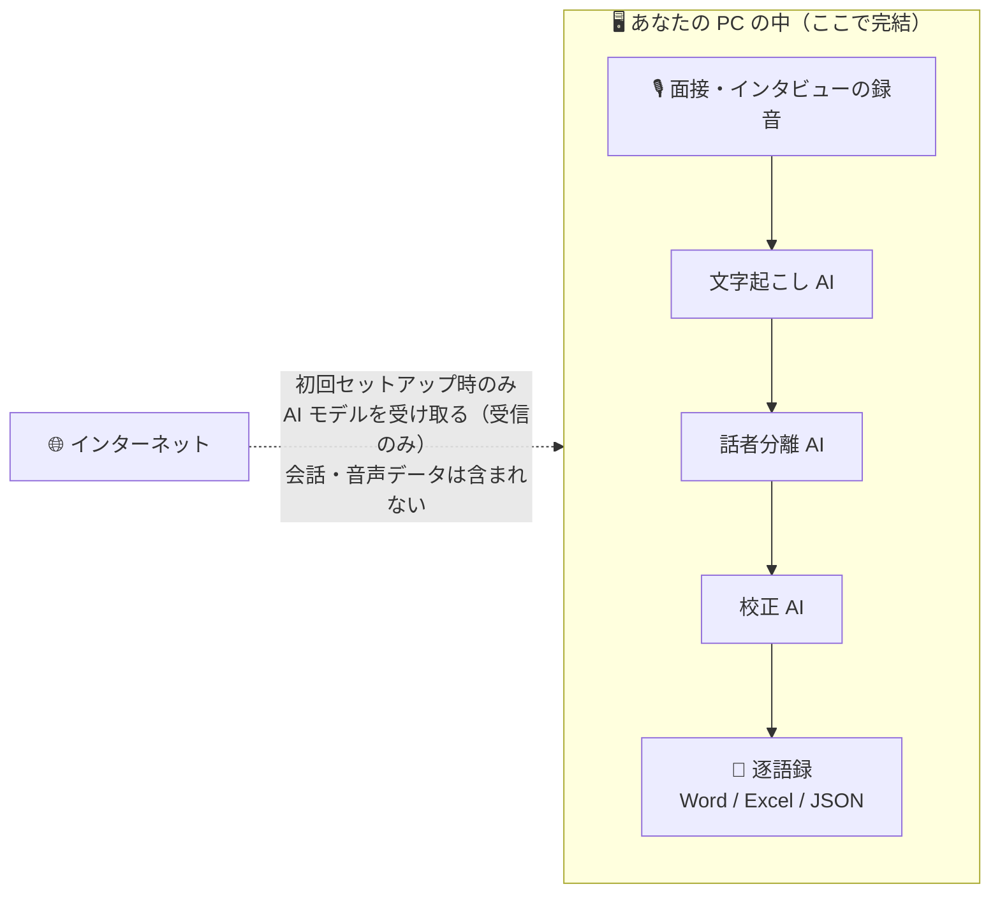
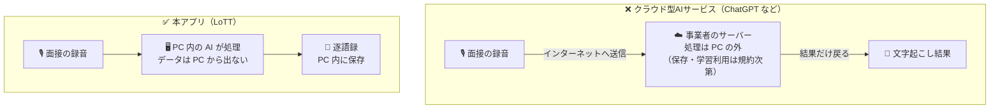

# プライバシー説明（非エンジニア向け）

このページは、臨床心理士・公認心理師・教員・学生など、**技術者でない方**に向けて、
本アプリ（Local Transcription for Therapy / LoTT)が会話データをどう扱うかを説明するものです。

## 一言でいうと

**録音も、文字起こし結果も、あなたの PC から出ません。**
文字起こし・話者分離・AI 校正はすべて、あなたの PC の中で動く AI が処理します。処理のためにインターネット上のサービスへデータを送ることはなく、そもそも送る機能自体がありません。

## データの流れ

※ 会話・音声データが PC からインターネットへ向かう矢印は、描き忘れているのではなく、**アプリにその経路が存在しません**。

## よくある質問

### Q. 「AI を使う」のに、なぜインターネットが要らないのですか？

ChatGPT などのクラウド型 AI は、データをインターネット上のサーバーへ送って処理します。
本アプリは方式が異なり、**AI モデルそのもの（数 GB のファイル）を最初にあなたの PC へダウンロードし、以後は PC のグラフィックボード（GPU）で動かします**。データが AI のところへ行くのではなく、AI がデータのところ（あなたの PC）に来ている、と考えてください。

### Q. インターネット接続が必要になるのはいつですか？

初回セットアップ（プログラム部品と AI モデルのダウンロード）のときだけです。このとき通信されるのは「どのファイルをダウンロードするか」という要求と、ファイルの受信だけで、**会話・音声データが送られることはありません**（そもそもセットアップ時点では会話データを扱っていません）。セットアップ完了後は、ネットを切ったままずっと使えます。

### Q. 本当に送信されていないか、自分で確かめられますか？

はい。**機内モードにして（または LAN ケーブルを抜いて）使ってみてください。全機能がそのまま動きます**。クラウドにデータを送る仕組みなら、この状態では動作できません。
詳しい手順（ファイアウォールでの恒久遮断や通信監視ツールでの観察を含む）は [オフライン動作の確認手順](offline-verification.md) にまとめてあります。また、本アプリはソースコードを公開しており、技術者であれば設計を直接検証できます。

### Q. 個人情報の保護のために、他にどんな工夫がありますか？

- **固有名詞の警告表示**: 文字起こし結果に含まれる氏名・地名など、個人の特定につながりうる語を自動で検出し、赤字などで警告します。逐語録を匿名化する際の見落とし防止を意図した機能です。
- **パスワード付き保存**: Word / Excel / JSON への保存時に、パスワード付きで出力できます。
- **処理の途中経過を残さない設計**: 処理中に一時的に作られるファイルは、アプリ専用の保護された場所に置かれ、処理後に削除されます。会話内容がログファイルなどに書き出されることはありません。

### Q. 逐語録作成の外部委託（テープ起こし業者）と比べてどうですか？

外部委託では録音データが業者の手に渡り、秘密保持契約などの管理が必要になります。本アプリではデータが**研究者・支援者自身の管理下を一度も離れません**。倫理審査等での説明については [倫理審査向け資料テンプレート](irb-template.md) を参照してください。

## 本アプリが守れないもの（正直な限界）

本アプリが保証するのは「アプリが会話データを外部へ送信しないこと」だけです。次の点は**利用者・組織側の管理**に委ねられます。

1. **PC 内に保存したファイルの保護**: 保存した音声・逐語録ファイルは、通常のファイルとして PC 内に残ります。PC の紛失・盗難に備え、ディスク暗号化（Windows の BitLocker 等）と、PC 本体・ログインパスワードの管理を行ってください。
2. **クラウド同期フォルダへの保存**: 保存先を OneDrive・Google Drive・Dropbox などが**自動同期しているフォルダ**（「デスクトップ」「ドキュメント」が同期対象になっている場合を含む）にすると、**ファイルはクラウドへアップロードされます**。これは本アプリではなく OS・同期ソフトの動作です。保存先には同期対象外のフォルダを選んでください。
3. **OS やドライバ自体の通信**: Windows・グラフィックドライバなどのシステム構成要素は、本アプリと無関係に通信することがあります。組織として完全なオフライン運用を求める場合は、OS やファイアウォール側の設定を併用してください。
4. **録音・利用そのものの適否**: 面接の録音についての同意取得、所属機関の個人情報保護規程・倫理指針の遵守は、利用者の責任で行ってください。本アプリはその作業を安全にする道具であり、手続きを代替するものではありません。

## もっと詳しく

- 確認手順: [オフライン動作の確認手順](offline-verification.md)
- 倫理審査向け: [倫理審査向け資料テンプレート](irb-template.md)
- 技術的な設計方針（開発者向け）: [README](../README.md)・[development.md](development.md)
